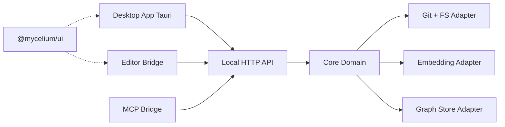
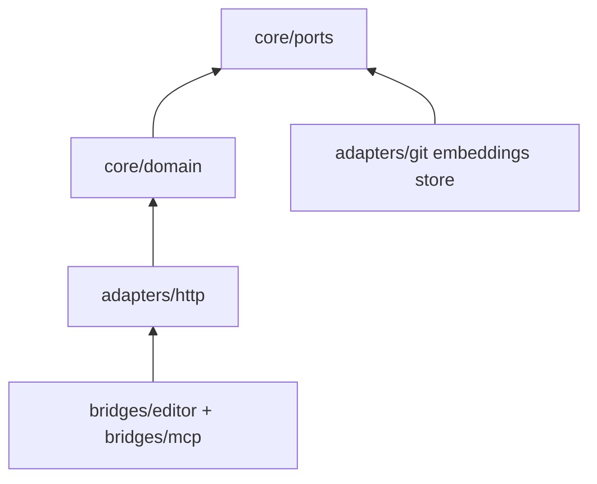
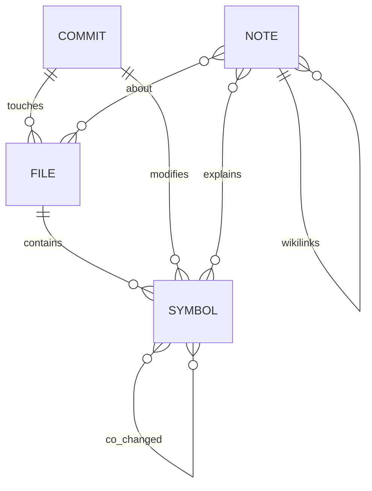

# Architecture Spine — Mycelium

## Design Paradigm

**Hexagonal (ports & adapters):** domain logic lives in the Core Service hexagon. Adapters: filesystem/git, Embedding runtime, Graph Store, HTTP API, Editor Bridge, MCP Bridge. Bridges are dumb; they never own ranking or indexing rules.



## Invariants & Rules

### AD-1 — Single local Core Service owns intelligence `[ADOPTED]`

- **Binds:** all FR-*; Desktop App; Editor Bridge; MCP Bridge
- **Prevents:** duplicated ranking/indexing logic per client
- **Rule:** Only Core Service may write Graph Store or compute rankings. Desktop, Editor, and MCP are clients via API (plus Desktop may supervise Core process lifecycle).

### AD-9 — Dual human surfaces, shared UI kit `[ADOPTED]`

- **Binds:** Desktop App; Editor Bridge; FR-14–FR-21
- **Prevents:** divergent visual systems and duplicated React components
- **Rule:** Desktop is the full console (workspaces, index, search, vault, settings). Editor Bridge is focus Context + quick Note only. Both consume `@mycelium/ui` for shared components/tokens.

### AD-2 — Local-first data plane `[ADOPTED]`

- **Binds:** FR-19, Embedding, Index
- **Prevents:** silent cloud upload of repo/Vault contents
- **Rule:** Default config uses localhost only. Any network call for generative LLM is explicit opt-in with user-supplied credentials. Embedding model download is one-shot, disclosed, and cacheable on disk.

### AD-3 — One Graph Store for humans and agents `[ADOPTED]`

- **Binds:** FR-18, Side Panel, MCP
- **Prevents:** divergent memory silos
- **Rule:** Editor and MCP query the same Nodes/Edges/vectors; no parallel “agent-only” database in MVP.

### AD-4 — Hybrid retrieval contract

- **Binds:** FR-9, FR-10
- **Prevents:** pure-vector or pure-keyword clients that diverge
- **Rule:** Every RAG Query and Focus Packet fuses (1) vector similarity, (2) keyword/FTS, (3) Graph proximity / explicit Edges. Fusion algorithm is Core-owned (RRF default). Top-k default ≤ 10.

### AD-5 — Vault is plain markdown on disk `[ADOPTED]`

- **Binds:** FR-11–FR-14
- **Prevents:** proprietary note DB lock-in
- **Rule:** Notes are `.md` files in a configurable Vault path. Wikilinks are source of truth; Graph Edges are derived indexes that can be rebuilt from disk.

### AD-6 — Dependency direction

- **Binds:** all packages
- **Prevents:** domain importing UI/MCP SDKs
- **Rule:**



Bridges → API → Domain → Ports ← Adapters. Never Domain → Bridges.

### AD-7 — Idempotent indexing

- **Binds:** FR-3, FR-4
- **Prevents:** duplicate Nodes on reindex
- **Rule:** Node identity is content-addressed (path + symbol span hash / commit hash / note path+hash). Reindex upserts; never creates parallel duplicates for the same identity.

### AD-8 — Two-speed enrichment (MVP uses cheap path only)

- **Binds:** ingestion
- **Prevents:** LLM cost on every keystroke
- **Rule:** Continuous path = parse + embed + graph edges. Expensive LLM structural summaries are deferred (not in MVP runtime).

## Consistency Conventions

| Concern | Convention |
| --- | --- |
| IDs | `node:{type}:{stable_key}` ; commit = git SHA; file = repo-relative POSIX path; symbol = `path#name@startLine` |
| Timestamps | ISO-8601 UTC in API JSON |
| API errors | `{ "error": { "code": "snake_case", "message": "..." } }` over HTTP |
| Config | `~/.mycelium/config.toml` + per-workspace `.mycelium/` |
| Logging | structured JSON to local log file; never log full file bodies at info level |
| Secrets | no repo content in env vars; LLM keys in OS keychain or user config file with 0600 perms |

## Stack

| Name | Version |
| --- | --- |
| Python | 3.12.x |
| FastAPI | latest stable at implement time (pin in lockfile) |
| uvicorn | pin with FastAPI |
| tree-sitter + language grammars | current stable |
| LanceDB | current stable Python client |
| SQLite | stdlib / system |
| sentence-transformers | current stable |
| Embedding model (default) | `jinaai/jina-embeddings-v2-base-code` `[ASSUMPTION pending eval]` |
| TypeScript | 5.x |
| React | 19.x (or current stable) |
| Desktop shell | **Tauri 2** `[ADOPTED]` |
| VS Code Extension API | engine matching current VS Code/Cursor |
| Shared UI | `@mycelium/ui` React package (Desktop webview + extension webview) |
| MCP TypeScript or Python SDK | current stable (Python preferred beside Core) |

## Structural Seed

```text
mycelium/
  core/
    domain/
    ports/
  adapters/
    http/
    git/
    embeddings/
    store/
  bridges/
    desktop/         # Tauri 2 app (React)
    vscode/          # Editor Bridge webview (React, shared UI)
    mcp/
  packages/
    ui/              # @mycelium/ui shared components
  vault/
  tests/
```



## Capability → Architecture Map

| Capability | Lives in | Governed by |
| --- | --- | --- |
| FR-1–FR-4 Workspace/index | `core/domain` + `adapters/git` + `adapters/http` | AD-1, AD-2, AD-7 |
| FR-5–FR-7 Ingestion | `adapters/git` + tree-sitter in domain pipeline | AD-7, AD-8 |
| FR-8–FR-10 RAG | `adapters/embeddings` + `adapters/store` + ranking domain | AD-4 |
| FR-11–FR-13 Vault | filesystem Vault + store index | AD-5 |
| FR-14–FR-18 Desktop | `bridges/desktop` + `@mycelium/ui` | AD-1, AD-9 |
| FR-19–FR-21 Editor | `bridges/vscode` + `@mycelium/ui` | AD-1, AD-6, AD-9 |
| FR-22–FR-23 MCP | `bridges/mcp` | AD-1, AD-3 |
| FR-24 Privacy | config defaults + network policy | AD-2 |

## Deferred

- Team sync conflict resolution and ACLs (post-MVP)
- Click-through learning-to-rank (post-MVP heuristics-first)
- JetBrains bridge
- LLM structural summary pass
- Hosted vector DB / cloud deploy topology
- Exact Embedding model pin after laptop eval on Tyler’s repos
- Open-core license finalization
- Electron vs Tauri final pin if Tauri blocked on packaging
- Full Obsidian-compatible plugin host inside Desktop
