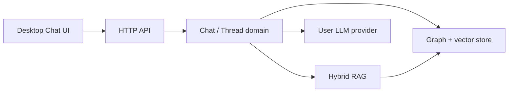

# RAG conversation window — design

**Date:** 2026-07-27  
**Status:** Accepted  
**Product:** Mycelium — local-first context layer  
**Related:** [[2026-07-27-context-receipts-design]], [[2026-07-27-agent-context-tools-design]], [[docs/POSITIONING]], ADR codebase-index-over-chat-memory

Implementation plan: `docs/superpowers/plans/2026-07-27-rag-conversation-window.md`

## Goal

Let users keep a **long-running conversation without replaying the full transcript on every model call**. Each LLM request is assembled from:

1. System / prefs slice (existing brain pack / config — same budget discipline as `session_start`, not full vault)  
2. A small **recent tail** (last 1–2 turns) for local coherence  
3. **Thread RAG** hits — only chunks ranked relevant to the new message  
4. Optional **code / vault RAG** hits (existing hybrid retrieval)

The human UI may still show the full transcript. The **model prompt never concatenates the entire thread**.

## Problem

Cursor (and typical chat UIs) resend the whole conversation every turn. That fills the context window with stale tool dumps and early turns. Mycelium already compact-packs *code* context (packets, receipts, budgets) but does not yet own a chat loop where conversation itself is retrieval-shaped.

**Hard constraint:** Mycelium cannot rewrite Cursor’s conversation window. Guaranteeing “only RAG-relevant context” requires Mycelium to **own LLM request assembly**.

## Positioning (ADR alignment)

- This is **not** an “agent memory vault” that auto-journals Cursor chats into the Thinking Vault.  
- Thread history is a **separate indexed corpus** (working memory for Mycelium Chat), retrieved like code.  
- Vault remains curated: optional handoff notes under `work/active/`, never raw transcript dumps.  
- Marketing stays: token efficiency via retrieval — now including conversation slices when the chat runs through Mycelium.

## Approach (locked)

**Mycelium-owned chat + thread RAG (Desktop → Core).**

Rejected for the guarantee:

- Cursor MCP-only “search my past turns” — Cursor still sends the full thread.  
- Handoff / new-chat as the primary fix — forces chat restarts; useful as optional pin, not the main path.

Optional later: thin MCP tools to search/append Mycelium threads for Cursor agents — without claiming Cursor’s window is fixed.

## Architecture

Hexagonal Core (AD-1): Desktop is a client. Core owns thread storage, chunking, embedding, hybrid retrieval, context assembly, and (opt-in) LLM calls (AD-2).

**Per-turn pipeline**

1. Persist incoming user message as a Turn (+ embeddable Chunks).  
2. Retrieve: thread-scoped hybrid RAG + optional workspace code/vault RAG.  
3. Assemble prompt under hard budgets (never “fall back to full thread”).  
4. Call LLM with assembled messages only.  
5. Persist assistant Turn + Chunks; mint receipt; record Impact.  
6. Return reply + receipt (hits, budgets, assembled vs full-thread estimate).

## Data model

| Entity | Id shape | Notes |
| --- | --- | --- |
| Thread | `thread:{uuid}` | workspace_id, title, timestamps, optional handoff note path |
| Turn | `turn:{thread_id}:{seq}` | role: `user` \| `assistant` \| `system` \| `tool`; text; token_est |
| Chunk | `node:thread_chunk:{thread_id}:{turn_seq}:{chunk_i}` | kind `ThreadChunk`; same Graph Store as File/Symbol/Note (AD-3) |

Chunking: split long turns; tool results stored as summarized/truncated text suitable for retrieval (pointer-first: prefer paths/ids over giant dumps when the turn already cited a receipt).

Idempotent upserts on retry (AD-7).

## Retrieval & budgets (defaults, tunable)

| Slice | Default budget |
| --- | --- |
| Recent tail | ≤ ~400 tokens (k = 1–2 turns) |
| Thread RAG | ≤ ~1500 tokens |
| Code / vault RAG | ≤ ~1500 tokens |
| Assembled prompt hard cap | enforced; drop lowest-ranked RAG hits first |

Hybrid fusion stays Core-owned (AD-4): vector + FTS + optional edges from thread chunks to cited code nodes. Top-k default ≤ 10 per scope.

**Invariant:** Assembled set ⊆ tail ∪ RAG hits. No silent inclusion of other turns.

## HTTP API

| Endpoint | Purpose |
| --- | --- |
| `POST /threads` | Create thread for a workspace |
| `GET /threads` | List threads |
| `GET /threads/{id}` | Metadata + paginated turns for **UI display** (not model prompt) |
| `POST /threads/{id}/messages` | Chat turn: assemble → LLM → persist → reply + receipt |
| `POST /threads/{id}/search` | Thread-only RAG (debug / future MCP) |
| `POST /threads/{id}/handoff` | Write curated `work/active/` note (summary + receipt/ids; no full transcript) |

Errors use existing `{ "error": { "code", "message" } }` shape.

## Desktop UX

- New **Chat** nav: thread list + full transcript for humans + composer.  
- Collapsible **Context used** panel: receipt — budgets, hit ids/paths, `tokens_assembled` vs `tokens_full_thread_est`.  
- Soft nudge when budget is hot or thread is large: pin handoff (explicit).  
- Settings: LLM provider + API key (opt-in, keychain/config 0600); budget overrides.

## MCP (v1 thin / optional)

- Do **not** claim Cursor conversation compaction.  
- Optional later: `mycelium_thread_search` / append for agents grounding on a Mycelium thread.  
- Existing session/receipt tools unchanged ([[2026-07-27-agent-context-tools-design]], [[2026-07-27-context-receipts-design]]).

## Triggers

- **Explicit:** user sends a message; user pins handoff.  
- **Soft nudge:** receipt / UI metadata when assembled budget or thread size is hot — agent/UI may suggest handoff; never auto-dump vault.

## LLM

- Explicit user credentials only (AD-2).  
- No key → **block send** with Settings CTA (no silent cloud).  
- Embed/index lag → tail-only + `reason=index_stale` on receipt; never full-thread fallback.

## Impact

Per turn: `tokens_assembled`, `tokens_full_thread_est`, `tokens_saved_est`, `receipt_id`.  
Aggregate on Impact page: chat turns using RAG window (same illustrative→telemetry path as pack metrics).

## Non-goals (v1)

- Auto-ingest of Cursor / Claude chat transcripts  
- Guaranteeing smaller Cursor context windows  
- Storing full transcripts in the Thinking Vault  
- Auto-summarizing every turn into ADRs  
- Multi-user / cloud-hosted thread sync  

## Testing

- Unit: assembler never includes turns outside tail ∪ RAG set; budget caps; idempotent chunk upsert.  
- Integration: `POST .../messages` returns receipt with hit ids; Impact event recorded.  
- Handoff note contains summary + links/ids, not full transcript body.  
- Failure: missing LLM key → 4xx with clear code; stale index → warning, not full dump.

## Success criteria

1. A thread with hundreds of turns still prompts the model with a **bounded** assembled packet (defaults above).  
2. UI shows full history; **Context used** proves the model did not receive the full thread.  
3. Impact reports estimated tokens saved vs full-thread replay.  
4. Positioning and vault write policy remain: no chat-journal vault.

## Implementation order (hint for plan)

1. Core: thread/turn/chunk store + thread-scoped RAG + assembler (no LLM; fixture “echo” provider for tests)  
2. Core: real LLM adapter + `/threads/{id}/messages`  
3. Desktop Chat UI + Context used + Settings key  
4. Impact events + handoff endpoint  
5. Optional MCP thread search  

## Open questions resolved in brainstorm

| Question | Decision |
| --- | --- |
| Pain | Cursor/conversation growth (transcript), not only Mycelium packet size |
| Fix surface | Product feature; Mycelium-owned chat required for the guarantee |
| Storage | Thread index in Core Graph Store; optional curated vault handoff |
| Triggers | Explicit send/handoff + soft budget nudge |
| Cursor | Not fixed in v1; honesty in docs/UI |
